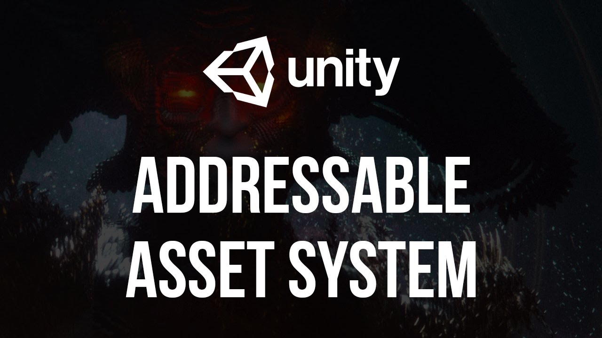

# Unity Addressables Learning

  

## DESCRIPTION
This my personal learning project about Unity's Addressable Asset System, where I discover how the package works, its best practice, and other useful features.

## TOOLS:
- Unity 2022.3
- Visual Studio Code

## LINKS
[__My in-depth documentation__](https://docs.google.com/document/d/1xxT47xdF2Jw8Z_8L6Gkj3tZh-P_Wvok6ryZSGwPA6IQ/edit?usp=sharing)